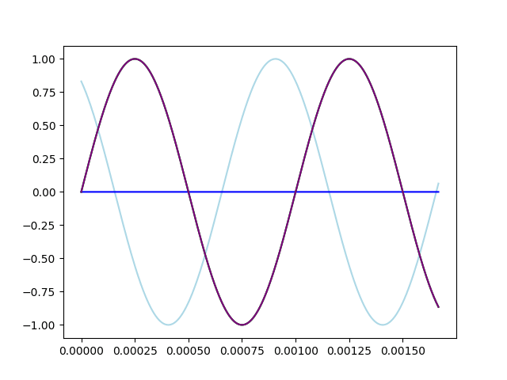

At today's meeting, our team performed a test of the DTMF system that is the base of our guiding system.

{/* truncate */}
DTMF or dual-tone multi-frequency signalling was used in old telephones. Even now some phones can beep differently based on what number you pressed. Every digit, characters * and # and letters A to D have 2 assigned frequencies arranged like in table 1.

|        | 1209 Hz | 1336 Hz | 1477 Hz | 1633 Hz |
| ------ | ------- | ------- | ------- | ------- |
| 697 Hz | 1       | 2       | 3       | A       |
| 770 Hz | 4       | 5       | 6       | B       |
| 852 Hz | 7       | 8       | 9       | C       |
| 941 Hz | *       | 0       | #       | D       |
Table 1: DTMF frequencies combinations

Most of our team members are now HAM radio operators and proud owners of our portable radios. Our mentor knew that those radios can transmit DTMF by pressing PTT (Push To Talk) button and a number button.

How our guidance system works. Let's assume that we are using numbers 1, 4 and 7.

    
How to choose the suitable numbers

    The numbers you chose have to have one common frequency. Therefore they have to be either in the same row or column. 

If we arrange those 3 transmitters in an equilateral triangle we can guide the receiver station to the middle of the triangle. To understand how that would work one first needs to understand the addition of sine waves.

If you have multiple signals made of sine waves of multiple frequencies you can add all sinuses with the same frequency first and then add sums to get the sum of all signals. Sum of 2 sine waves with same frequency will have the lowest amplitude if amplitude of both of them is equal (it will be 0 if signals are 180° out of phase).

    
Graph exlanation

    Although the graph shows 2 waves it works similarly with 3.
    - The light blue line shows the output signal of station 1
    - The light green line shows the output signal of station 2
    - The blue line shows the received signal from station 1
    - The green line shows the received signal from station 2
    - The purple line shows the sum of received signals
    For 3 stations just imagine one graph like this for every pair.

The amplitude of the sum can be used to find the distance from centerpoint of transmitting stations to the receiver. If we have 3 of those differences, we can try to minimise all of them and when the amplitude if all received sine waves is smallest we know we hit the center of the triangle. 