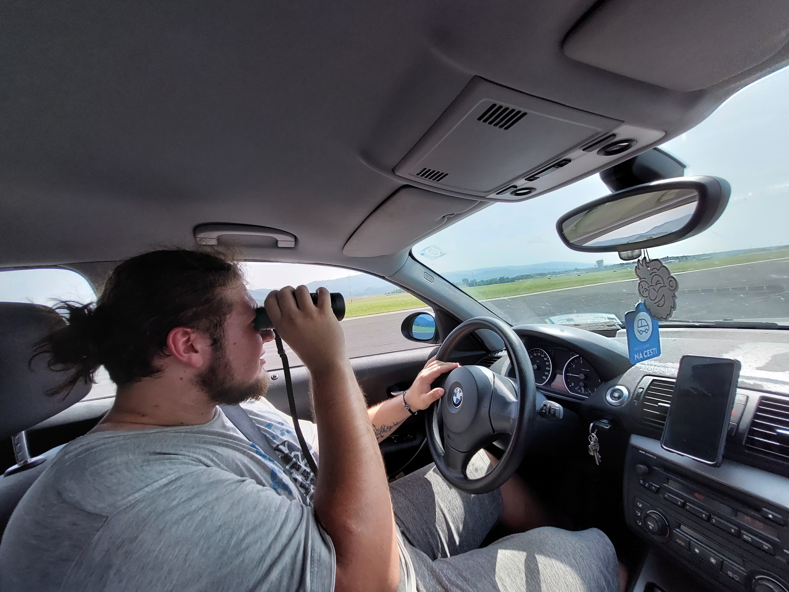

On Tuesday, 20. 6. our team visited the Aerodium vertical wind tunnel in Logatec, who have kindly allowed us to test our CanSat in their facility. Our parachute performed exceptionally well, but unfortunately, we ran into some issues with the battery so we couldn’t test our motors.

{/* truncate */}

The next day, we went on a trip to a military air base near Cerklje ob Krki, intending to test our locator and guidance systems, as well as the primary mission hardware and software. The test started off quite badly, as the L293D IC controlling our motors died and we had no spares, so we had no guidance.

With that in mind, we set off to ascend to a kilometer aboard a Bell 206 helicopter of the Slovenian army. With help from two very kind soldiers, we successfully dropped the CanSat. Due to its small size, we were, unfortunately, unable to watch it descend.

Here is where the real trouble began. Due to a malfunction in the ground station antenna, we received no data from the CanSat during its flight. But OK, it's a missed opportunity for a proper test, or so we thought. The bad news didn't end there. As we set off to recover our CanSat, we quickly realized the transmitter onboard had stopped transmitting. We had no way to find our CanSat using radios, and after three hours of sweeping the airfield, we gave up. We concluded that the antenna on the APC220 transmitter must have broken off during the harsh landing.

We are now left without a CanSat, four days before we leave for Spain. But we will make it, we always have. This experience taught us many important lessons, which we are taking into consideration as we build CanSat #2. Our design has changed. Instead of four horizontal PCBs, which needed to be inter-connected, introducing multiple points of failure, we designed two vertical PCBs, independent of each other, thus reducing many points where our CanSat could fail. Besides getting rid of janky connections between PCBs, we also repositioned our antenna so that it takes up less space and can be additionally braced and reinforced. We also put the buzzer on a separate PCB, with its own battery. The motors now also have a switch to turn them off during testing.

Despite our bad luck yesterday, we'd like to thank both Aerodium Logatec and the Slovenian army for helping us with our tests and teaching us many important lessons.
